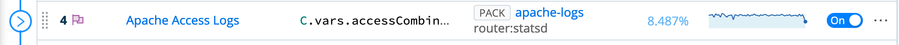

# Changes to the Demo Environment

## June 4, 2021

### Demo Changes
* The three apache log based pipelines in dc1-logs (enrich, logs_to_metrics, and sample_and_filter) are now part of the "Apache Logs" Pack. To show those pipelines, go to the routing table, and find the "Apache Access Logs" route:

You'll see that In the pipeline/output section, there is now a "pack" icon next to the pack name. You can click on the pack name link, which takes you to the pack interface.
* The firewall_geoip_enrich pipeline (dc1-logs group) has now also moved to a pack, named pan-firewall-traffic.
* The vpcflow_geoip_enrich pipeline (aws group) has also moved to a pack, named vpcflow-parse.
* The demo is now Appscope ready - it is not enabled by default, but can be - see the [APPSCOPE.md](APPSCOPE.md) document. 
* The trim_json pipeline and route has been moved back to the dc1-logs group.
* AppScope "skeleton" is setup for all services but influx (disabled due to TLS bug with AppScope 0.6.1, will renable after 0.7.0). AppScope is not enabled by default (see [APPSCOPE.md](APPSCOPE.md) for details on enabling it). It is enabled on the Cribl official demo environments.
* New `AppScope Metrics` dashboard in Influx shows stats for the environment by service. This will evolve over time. 

### Structural Changes
* One of the big problem areas in running the demo setup has been the disparity between helm deployment and manifest deployment, specifically with the setup of influxdb - job timeouts have been the biggest contributor to standup failure. In this version, instead of maintaining a copy of helm charts and using the helm capability to install them, we're making use of a pattern where we "hydrate" the chart into a manifest regularly and commit that, which has minimize the use of helm in the setup. 
* Additionally, far fewer custom images are being built as a part of standup. We've made use of the new features in the cribl helm charts that allow configmaps to be referenced. Unfortunately, this necessitates a "setup" script be run prior to skaffold being called, but the benefits of this approach outweigh the negatives. 
* The data collection data generation (gogen-datacollection-syslog and cribl-sa) have now been converted to K8s jobs.
* The cli-deploy and api-deploy scripts have been deprecated in favor of a new ls-deploy-job K8s job that not only commits and deploys initial configuration, but also handles installation of Packs, a new feature in LogStream 3.0.
* Appscope is now an option - you can now enable appscope for the namespace you're running in, and have it deliver it's data to the cribl-w2 instance. This is *not* available on the `dev`, `minimal` or `nogen` profiles, as it requires the entire pod set in place.
* Profiles have changed a little bit, and can be combined if necessary - see the [README.md](README.md#profiles) for descriptions and usage details.

	

  

## Feb 5, 2021

### Structural Changes

* Moved cribl-demo to only run on Kubernetes, retiring the docker-compose framework, as well as the env-builder based mastering of the repo. 
* Worker Group Changes - To show that worker group definition is somewhat arbitrary, based on the needs of the customer, and not necessarily based on any functional best practice.

	* Renamed worker groups:

      |Old|New|
      |---|---|
      |logs|dc1-logs|
      |metrics|dc1-metrics|

    * Introduced new worker group: aws, and moved the Trim Big JSON demo flow to it.
    
* Added vpcflow logs data, collector and pipeline to the aws worker group. This also includes a redis lookup of aws account id to name, and the pipeline is modeled after the firewall_geoip_enrich pipeline in dc1-logs, implying that you can use logstream to unify two disparate types of log data (PAN firewall + VPC flowlogs)

* Replaced old demo redis_lookup function in enrich pipeline with the new (2.4+) redis function.

* Created a new branch `docker-legacy` to support people transitioning from the docker-compose based flow to the kubernetes flow, which will be present until 4/1/2021 as a "transition period"

* Cleanup and bug fixes as requested by the SE team and others.

# Topology

