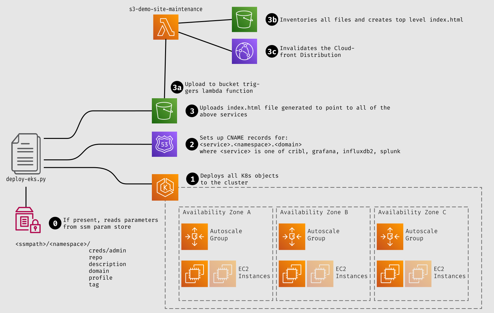
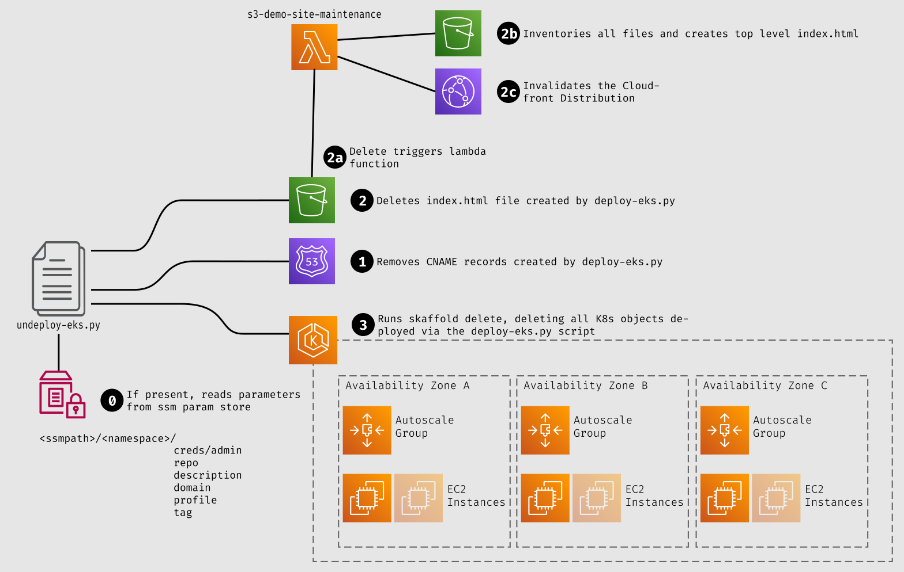

# Running on EKS

If you want to run the cribl-demo on EKS, this document covers that. It is cumulative with the pre-requisites listed in [README.md](README.md). Running in "Production" mode on an EKS cluster requires a few additional steps.

## Pre-Requisites for Deployment Scripts

You will need to have a working python3 installation along with a working pip (or pip3) install to be able to deploy to EKS.

```
pip install -r ./requirements.txt
```
additionally, you'll need to have active AWS credentials in the shell.


## Deploy-Eks
This script handles the deployment of the demo environment to EKS, and the steps to create Route53 entries for all user facing services, as well as creating and posting an index.html with links to those services.



Running in EKS requires that you push the docker images up into ECR. ECR's repository structure requires that you pre-create the repos for each image. The script `deploy-eks.py` will create the ECR repos and build and deploy to your EKS cluster. You will need to run pip on the requirements.txt file, like this:


### Running
You can run the `deploy-eks.py` script, as follows:

```
./deploy-eks.py -c <repo head default:cribl-demo> [-d <domain default:demo.cribl.io>] [-n <namespace default:default>] [-r <region default:us-west-2>] [-a <description default:Demo Environment>] [-s <ssmpath default:/cribl/demo>] [-p <profile>]
```

or if you're using V2 of the AWS CLI, invoke it as follows:
```
aws2-wrap --profile <AWS Profile> --exec "./deploy-eks.py -c <repo head default:cribl-demo> [-d <domain default:demo.cribl.io>] [-n <namespace default:default>] [-r <region default:us-west-2>] [-a <description default:Demo Environment>] [-s <ssmpath default:/cribl/demo>] [-p <profile>]"
```

## Undeploy-EKS
This script "undeploys" the deployment of the demo environment resources, the Route53 entries associated with it, and the index.html file for those services.



This script is the comprehensive way to "undeploy" an environment deployed with deploy-eks.py - it will not only run skaffold delete, but will also remove the CNAME entries from the Route53 hosted zone (domain), and remove the index file from s3.

### Running

Options for `undeploy-eks.py` are a subset of the options for `deploy-eks.py`

```
./undeploy-eks.py -c <repo head> [-d <domain default:demo.cribl.io>] [-n <namespace default:default>] [-r <region default:us-west-2>] [-s <ssmpath default:/cribl/demo>]
```

or if you're using V2 of the AWS CLI, invoke it as follows:
```
aws2-wrap --profile <AWS Profile> --exec "./undeploy-eks.py -c <repo head> [-d <domain default:demo.cribl.io>] [-n <namespace default:default>] [-r <region default:us-west-2>] [-s <ssmpath default:/cribl/demo>]"
```

## Using SSM parameters instead of command line options
The addition of the -s \<ssmpath\> option allows all of the command line options to be stored in the parameter store, to simplify calling the script. This is helpful for long lived cribl-demo instances that need to be redeployed regularly (like our own demo environments). The SSM Parameter store keys off the namespace that is specified, looking for parameter path of `<ssmhead>/<namespace>` and enumerating the parameters under that path as options for the scripts to use. 

SSM Parameters are not created by either script - you need to do that manually. The scope of parameter store setup is beyond this document, but is documented in the [AWS Systems Manager Guide](https://docs.aws.amazon.com/systems-manager/latest/userguide/systems-manager-parameter-store.html)

## Arguments
|Command Line Option|SSM Parameter|Default Value|Description|
|-------------------|-------------|-------------|-----------|
|-c \<repo head\>|`<ssmhead>/<namespace>/repo`|`cribl-demo`|The name to use as the "directory" in the ECR repo structure - each image will end up as \<repo head\>/\<image name\>:\<tag\>|
|-d \<domain\>|`<ssmhead>/<namespace>/domain`|`demo.cribl.io`|The domain to use - this will be looked up in Route53 - it defaults to demo.cribl.io. The domain must be a domain that is manageable from the account this is being run in. This will also be used in reverse notation (i.e. demo.cribl.io becomes io.cribl.demo) for the bucket name to upload the index files to.|
|-n \<namespace\>|`<ssmhead>/<namespace>`|`default`|The k8s namespace that it should be deployed into. This defaults to "default", but it's recommended to use a separate namespace for each environment.|
|-s \<ssmpath\>|`<ssmpath>`|`/cribl/demo`|Uses the ssmpath specified to locate configuration for the namespace specified. |
|-r \<region\>|`<ssmhead>/<namespace>/region`|`us-west-2`|The AWS region to deploy into.|
|-a \<description\>|`<ssmhead>/<namespace>/description`|`Demo Environment`|The description of the environment for the index page that gets generated. This can be html format (only available in `deploy-eks.py`).|
|-p \<profile\>|`<ssmhead>/<namespace>/profile`|none|The skaffold profile to use (only available in `deploy-eks.py`)|


