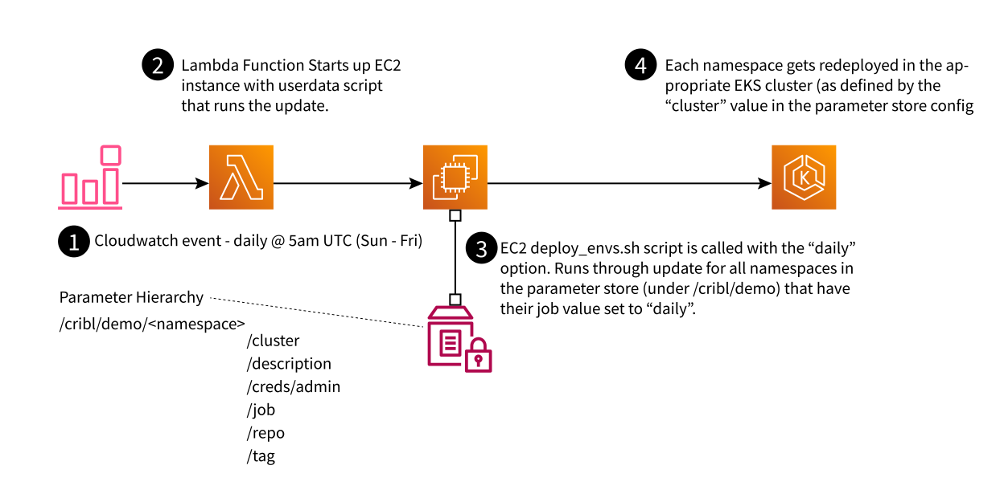

# Demo Refresh Lambda

## Purpose
This CDK app deploys a lambda function with a cloudwatch event setup to run at 5am Sun-Fri UTC, creating an EC2 instance that uses a userdata script to find all of the demo envs in the aws account that are configured for daily refresh and execute the refresh process (eks-undeploy.py + eks-deploy.py) on them.

