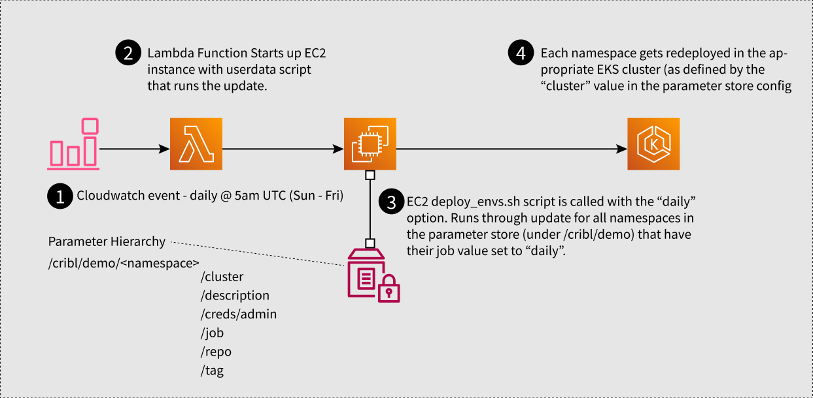

# Demo Refresh Lambda

## Purpose
This CDK app deploys a lambda function with a cloudwatch event setup to run at 5am Sun-Fri UTC, creating an EC2 instance that uses a userdata script to find all of the demo envs in the aws account that are configured for daily refresh and execute the refresh process (eks-undeploy.py + eks-deploy.py) on them.



The Lambda only serves to create the EC2 instance. The userdata script for the ec2 instance runs the actual update process. There are a few distinct operations:

<dl>
<dt>Setup</dt>
<dd>Replacing the existing python with 3.8, installing pip3, unzip, docker and the AWS CLI.</dd>
<dt>Dependencies</dt>
<dd>Installing the appropriate utilities for the cribl-demo repo deploy: skaffold, kubectl, and helm
<dt>Repo & Run</dt>
<dd>Clones the cribl-demo repo, checks out the appropriate branch, installs dependencies for the scripts, then runs `scripts/deploy_envs.sh daily`, which parses the SSM param hierarchy to figure out which namespaces to act on, and then calls `undeploy-eks.py` and `deploy-eks.py` for each of the namespaces in question. </dd>
<dt>Cleanup</dt>
<dd>grabs instance id from metadata, and then terminates itself.</dd>
</dl>

looks like this:

```
#!/bin/bash

export AWS_DEFAULT_REGION=us-west-2
export HOME=/root


# Setup
cd /home/ubuntu
apt update
apt remove -y python3.6
rm /usr/bin/python3
apt install -y python3.8 python3-pip unzip docker.io software-properties-common
ln -s /usr/bin/python3.8 /usr/bin/python3
curl "https://awscli.amazonaws.com/awscli-exe-linux-x86_64.zip" -o "awscliv2.zip"
unzip awscliv2.zip
usermod -aG docker ubuntu
./aws/install

# Dependencies
curl -Lo skaffold https://storage.googleapis.com/skaffold/releases/v1.17.2/skaffold-linux-amd64 && chmod +x skaffold && mv skaffold /usr/local/bin

curl -LO https://storage.googleapis.com/kubernetes-release/release/$(curl -s https://storage.googleapis.com/kubernetes-release/release/stable.txt)/bin/linux/amd64/kubectl \
&& install kubectl /usr/local/bin && rm kubectl

curl https://baltocdn.com/helm/signing.asc | apt-key add - && \
apt-get install apt-transport-https --yes && \
echo "deb https://baltocdn.com/helm/stable/debian/ all main" | tee /etc/apt/sources.list.d/helm-stable-debian.list && \
apt-get update && \
apt-get install -y helm

#curl https://raw.githubusercontent.com/helm/helm/master/scripts/get-helm-3 | bash

# Repo & Run
git clone https://github.com/criblio/cribl-demo.git
cd cribl-demo/
git checkout eks-improvements
git pull
pip3 install -r ./requirements.txt  -t .
./scripts/deploy_envs.sh daily


# Cleanup
TOKEN=`curl -sq -X PUT "http://169.254.169.254/latest/apec2-metadata-token-ttl-seconds: 21600"`
export INSTANCEID=$(curl -sq -H "X-aws-ec2-metadata-token: $TOKEN"  http://169.254.169.254/latest/meta-data/instance-id)

aws ec2 terminate-instances --instance-id $INSTANCEID
```